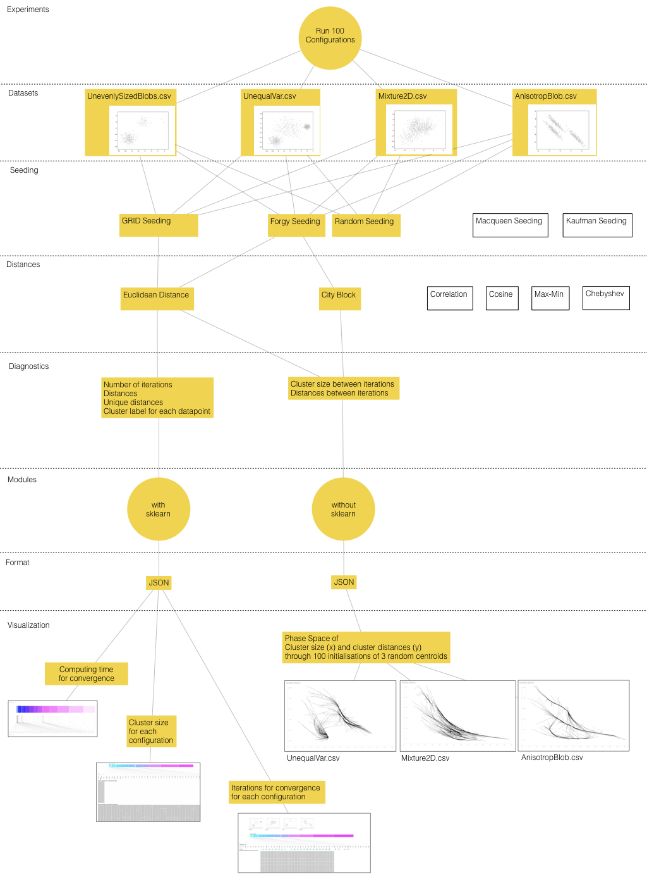
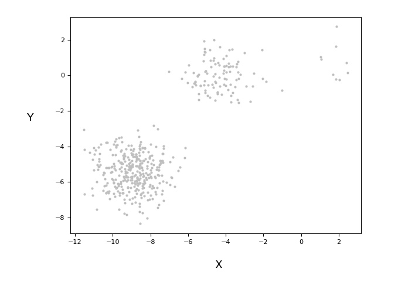
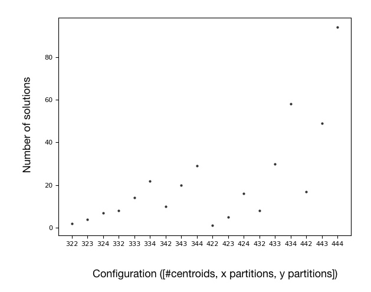
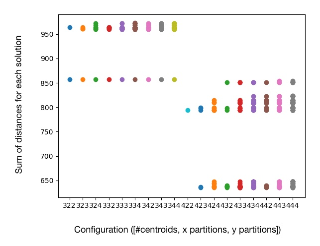
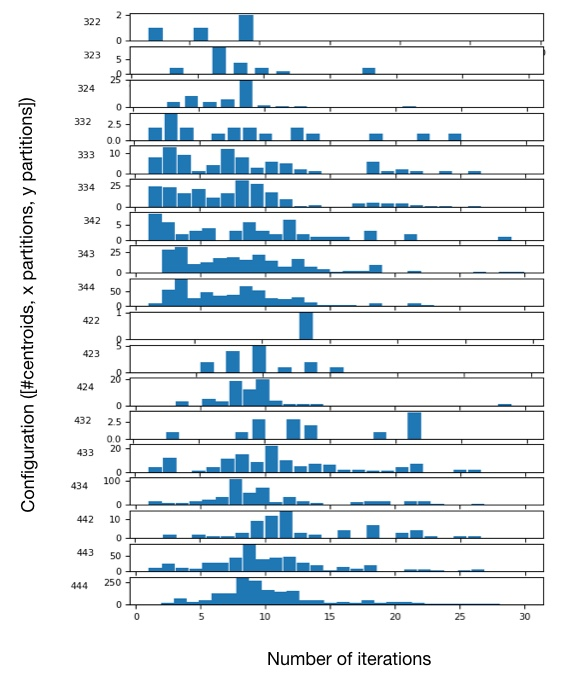
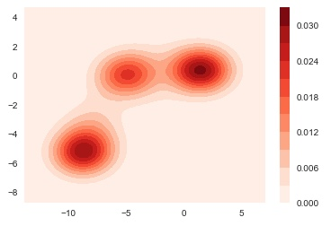
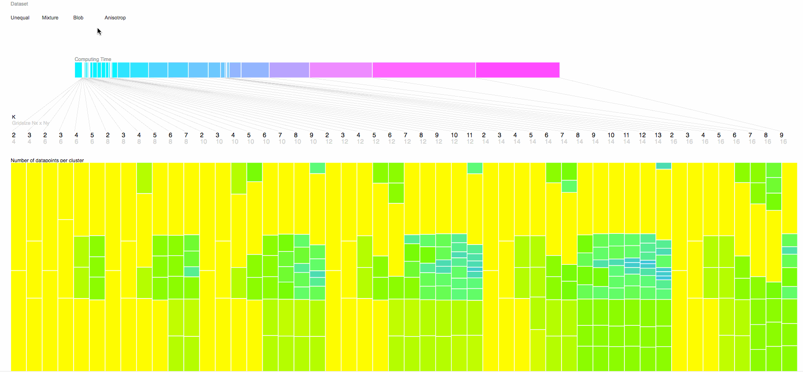
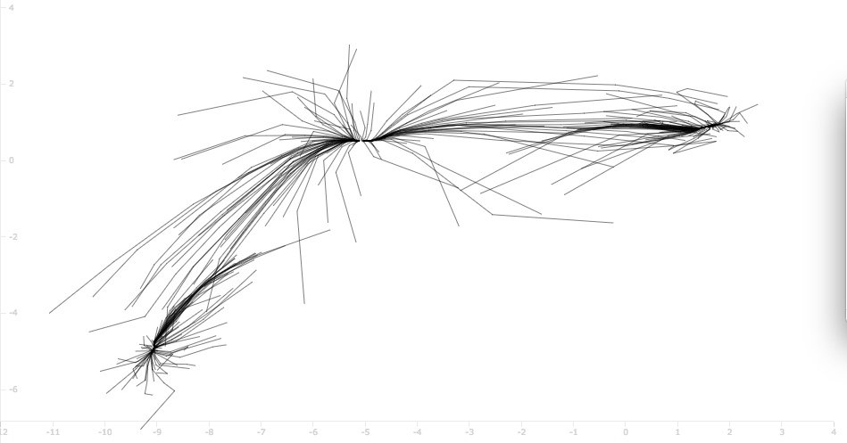
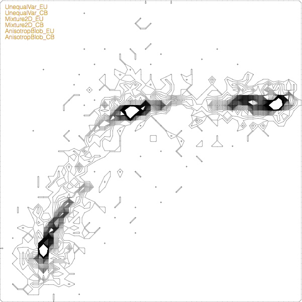
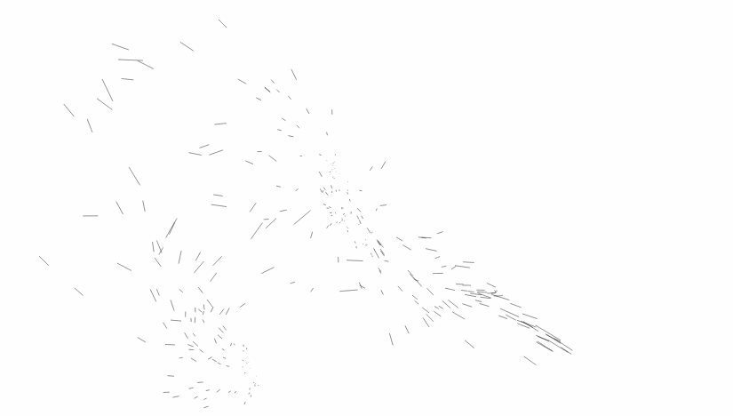

# Parameter Space Visualization

## Contributeurs

* Jorge Martinez-Rey
* [Romain Vuillemot](http://romain.vuillemot.net/)
* [Stéphane Derrode](http://www.ec-lyon.fr/contacts/stephane-derrode)

*Ce projet a été soutenu par l'action [Projet-Transversal](https://liris.cnrs.fr/projets-transversaux) du LIRIS*

## Aperçu

Il y a deux programmes principaux:
1. **VisuKmeans.py** : premiere version des programmes non opitmisée. Cette version est essentiellement conservées pour les bouts de code qu'elle contient.
2. **kmeansinit.py** : seconde version plus aboutie, dans la mesure où on réduit le nombre de calcul de kmeans au minimum :
     * on évite de calculer les kmeans si les 2 centres sont initalisés à la même position, ou 
     * on évite de caculer le kmeans si le même calcul a été fait lorsqu'on échange les classes). 

Si je me souviens bien le prg fonctionne  pour une nombre de classes supérieur à 2. 

Il n'y a pas d'affichage graphique des classifications, mais je pense que tout est pret pour le faire : les listes *listeTraceLabels*, *listeTraceCenters*, *listeTraceInertia*, *listeTraceNbIter* continennent tous les résultats de classification pour l'affichage.

## Bilan d’activite

Le travail sur la visualisation du espace de paramètres dans algorithmes de classification a compris le développement de différents scripts de Python et D3.js, ainsi que contenus en HTML pour présenter le cas particulier du algorithme K-means.

Le cible de cette d’explorer tout l’espace de parametres possible a partir d’un jeu de donnees en 2D. La Figure 1, [Kmeans_Option_Diagram.key](https://github.com/romsson/kmeansvisu/blob/master/Kmeans_Option_Diagram.key), montre les differents categories explores dans ce periode de travail (en gris celles qui n’ont pas ete consideres dans les analyses): 

1. Jeux de donnees: 
    + UnevenlySizedBlobs
    + UnequalVar
    + Mixture2D
    + AnisotropBlob

2. Seeding techniques:
    + GRID
    + Forgy
    + Random
    + MacQueen
    + Kaufmann

3. Types de distances: 
    + Euclidean
    + City Block
    + Correlation
    + Cosine
    + MaxMin
    + Chebyshev

4. Diagnostiques sur la sortie 
    + Nombre d’iterations
    + Nombre de solutions
    + Distances lies a chaque solution
    + Taille des clusters

5. Modules de Python utilises
    + Avec SkiLearn
    + Sans SkiLearn

6. Format des fichiers de sortie
    + JSON

_Figure 1: Parcours de la recherche developpe sur les differentes options du algorithme K-means. En jaune les options consideres dans les scripts de Python et/ou D3.js et en blanc les options pas explores dans cet analyse a cause de sa complexite pour son implementation inmediate._

Liste des scripts developpes: 

### Python

Plateforme de calcul pour faire tourner l’algorithme et faire une extraction de diagnostics concernant les donnees d’entree, la performance de l’algorithme et la sortie de la classification et ses propriétés.

A. [Kmeansinit_Forward.py](https://github.com/romsson/kmeansvisu/blob/master/kmeaninit_forward.py)
Représentation graphique de différentes propriétés des donnes et tu GRID seeding: nombre total de solutions, solutions pour chaque configuration, histogram du nombre d'itérations de convergence, moyen et déviation standard de la distribution du nombre d'itérations (dans le cas gaussien).

_Figure 2: Distribution des datapoints dans l’espace cartesian pour le UnevenlySizedBlobs dataset._

_Figure 3: Nombre de solutions pour chaque configuration initial du GRID seeding pour le UnevenlySizedBlobs dataset. Dans ce cas, il y a 4 partitions sur chaque axis et un nombre de centrois d’entre 3 et 4._ 

_Figure 4:  Somme des distances pour chaque solution des differentes configurations initiales dans le cas du GRID seeding pour le UnevenlySizedBlobs dataset. Dans ce cas, il y a 4 partitions sur chaque axis et un nombre de centrois d’entre 3 et 4._

_Figure 5:  Histogram de la frequence du nombre d’iterations pour chaque configuration du GRID seeding pour le UnevenlySizedBlobs dataset. Dans ce cas, il y a 4 partitions sur chaque axis et un nombre de centrois d’entre 3 et 4._

B. [Kmeansinit_Forward_Config.py](https://github.com/romsson/kmeansvisu/blob/master/kmeaninit_forward_config.py)
Création d’un fichier JSON pour le stockage du nombre d'itérations, la sum de distances de chaque cluster, les solutions et les caractéristiques de configuration de chaque initialisation. Le fichier JSON a une entree pour chaque configuration initiale avec les champs suivantes: 

 + “Iterations”: Nombre d’iterations pour trouver une solution
 + “Inertia”: Somme des distances
 + “Solutions”: Nombre de solutions
 + “Config”: Nombre de centroids, partitions dans le x et partitions dans le y.  

C. [Kmeansinit_Forward_Labels.py](https://github.com/romsson/kmeansvisu/blob/master/kmeaninit_forward_labels.py)
Création d’un fichier JSON pour le stockage du temps de convergence, la position des centroids, la taille du GRID et le nombre de data points qui ont changé de cluster a chaque itération. Le fichier JSON a une entree pour chaque configuration initiale avec les champs suivantes:

+ “Time”: Temps de computation pour la convergence. 
+ “Centroid”: Position des centroids
+ “Gridsize”: Taille du grid
+ “Shifts”: Nombre de datapoints qui on change de cluster. 
+ “Order”: Index des differents clusters.  

D. [Kmeans_Standalone_PhaseSpace.py](https://github.com/romsson/kmeansvisu/blob/master/Kmeans_Standalone_PhaseSpace.py)
Création d’une version complètement customisable par rapport au GRID seeding, avec deux différentes options de seeding (Forge et Random) et avec deux types de distance (Euclidean et City Block, ou Manhattan). En plus, ca permettre de faire une extraction de diagnostiques entre chaque itération pour mieux comprendre les chemins de convergence. Création d’un fichier JSON avec la sortie des diagnostics. En particulier la convergence de différentes configurations initiales vers ses solutions dans le phase space: la taille des clusters versus la somme de distances. Le fichier JSON a une entree pour chaque configuration initiale avec les champs suivantes:

+ “Phase_x”: Nombre de datapoints dans chaque cluster a chaque iteration. 
+ “Phase_y”: Somme de distances dans chaque cluster a chaque iteration. 

E. [Kmeans_Standalone_DensityContours.py](https://github.com/romsson/kmeansvisu/blob/master/Kmeans_Standalone_DensityContours.py)
Script similaire au dernier, dans ce cas avec le calcul de la densité de trajectoires de convergence, soit dans l'espace cartésien, soit dans le phase space, par densité de points pour créer contours de densité. Création d’un fichier CSV avec les coordonnées de densité de trajectoires. Ce fichier a les valeurs de densite par ligne horizontal, du maximum au minimum du axis y. La creation posterior du fichier JSON avec la taille des axis (width, height) et la serie cree par le fichier CSV s’a fait a la main. 

_Figure 6: Contours de densite de points des trajectoires des centroids pour le UnequalVar dataset pour une initialisation des centroids Forgy._  

F. [Kmeans_Basic_InputOutput.ipynb](https://github.com/romsson/kmeansvisu/blob/master/Kmeans_Basic_InputOutput.ipynb)
iPython notebook sur la performance du GRID seeding sur K-means, avec un jeux de données et configurations exploratoires. 

 
### D3.js

Outil de visualisation en Javascript qui prend la sorti de Python en format .JSON et permet d'explorer les donnees de facon intuitive.

* [Index_GRID_all_Datasets_with_clustersize.html](https://github.com/romsson/kmeansvisu/blob/master/visu/index_GRID_all_Datasets_with_clustersize.html)
Visualisation du temps de convergence pour différentes configurations de GRID seeding. Dans le GRID seeding il y a d’un côté la partition dans les axes x et y, et aussi le nombre de centroids que on place dans la grille créée par le GRID seeding. Selon le nombre de centroids et la taille de la GRID, le algorithm et capable de converger plus lentement et plus vite. La visualisation montre un temps correle a le nombre de partitions dans les axis, avec une densite de temps de convergence autour d’un nombre plutôt petit de centroids places dans la grille.
Visualisation pour explorer la taille des clusters liés a chaque centroid. Quatre jeux de données sont explorés avec cette visu, ou on peut voir comment les data points sont distribués dans tailles de clusters plus ou moins communs pour tous les configurations et clusters plus petits une fois que on augmente le nombre de centroids. Ca parle de clusters qui sont constants indépendamment du nombre de centroids, et comment l’augmentation de centroids introduit une très faible variabilité  dans la distribution des points. 

_Figure 7:  En haut, temps de computation pour chaque configuration du GRID seeding. Les lignes associent chaque temps de computation avec le nombre de centroids et la taille (x-axis partitions x y-axis partitions) de la grille. En bas, la taille des clusters represente par la tailles des carres. La couleur est indicatif aussi de la taille, avec le jaune pour les clusters grands et le bleu pour les petits. Ca marche pour les quatre jeux de donnees._ 
 

* [Index_Centroid.html](https://github.com/romsson/kmeansvisu/blob/master/visu/index_centroid.html)
Visualisation des trajectoires de convergence des centroids dans l’espace cartesian sur la distribution de datapoints. Ca nous permets de voir deja les regions ou les trajectoires de convergence sont plus nombreuses, et donc certain chemins ou les solutions sont preferees par l’agorithme. La facon de converger depend de la position des centroids et donc la combinaison de trois centroids par rapport a la distribution de donnees define clairement une topographie precise ou l’algorithme cherche ses solutions. 

_Figure 8: Trajectoires des centroids dans l’espace cartesian de donnees du UnequalVar dataset. Un centaine d’initialisations Forgy, i.e., centroids qui sont deja une partie des donnees, convergent vers les solutions finales des trois clusters._

* [Index_contours.html](https://github.com/romsson/kmeansvisu/blob/master/visu/index_contours.html)
Visualisation de la densite de trajectoires de convergence. Cette visu est equivalent a la derniere, mais dans ce cas on montre la densite au tour des solutions. Comme ca la topographie est definie d’une facon plus traditionnelle. La visualisation permet d’explorer differents jeux de donnes ainsi que differentes types de distance (Euclidean ou City Block). Les differences dans ce cas ne sont pas grandes, mais ca montre la possibilite d’explorer les cartographies dans le phase space, ou l’hypothese est que les changements de topographies seront beaucoup plus grands. 

_Figure 9: Contours de densite des trajectoires de mille initialisations Forgy des centroids vers les solution dans l’espace cartesian de donnees du UnequalVar dataset, pareil a lequel montre dans la Figure 8. La variation de densite est entre 0 e 100 points de trajectoire, au dela la couleur reste blanc au centre des solutions._

* [Index_phasespace.html](https://github.com/romsson/kmeansvisu/blob/master/visu/index_phasespace.html)
Visualisation du espace de parametres pour nombreuses initialisations de K-means. Les trajectoires sont dans le espace de la taille des clusters et la sum de distances de chaque cluster. 

_Figure 10: Trajectoires d’une centaine d’initialisations dans le phase space pour les donnees UnequalVar. Dans ce cas, le phase space est defini par la taille des clusters et la somme de distances de chaque cluster. La progression des trajectoires est fait par le nombre d’iterations, pareille dans chaque trajectoire._
   

### HTML

Publication en format web d’une narrative concernant les possibilites d’exploration des parametres du K-means. 

* [Distill](https://github.com/romsson/kmeansvisu/tree/master/distill)

### Latex 

Introduction theorique du probleme de l’amplitude du parameter space dans les algorithmes et en particulier du K-means. 

* [Latex doc](https://www.overleaf.com/9805949mzsrpwdmhmkx#/35827864/)

